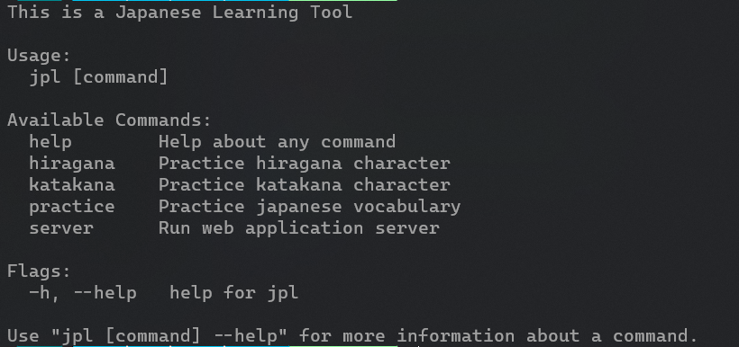
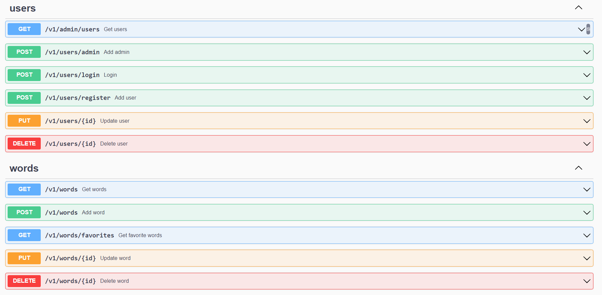

# Overview

JPL is a Terminal app to practice typing Hiragana and Katakana alphabet in Romaji. Built with [Cobra](https://github.com/spf13/cobra) and [Bubble Tea](https://github.com/charmbracelet/bubbletea)

It's also a REST API Server, Build with [Gin](https://github.com/gin-gonic/gin), [Swagger](https://github.com/swaggo/swag) and [Gorm](https://github.com/go-gorm/gorm)

## Features

- Practice Hiragana and katakana alphabet by cmd
- Learn japanses words
- Register and login user with token, is built with jwt
- Login with firebase
- CRUD word, follow REST API, with database PostgresSQL
- Middleware check token when user access resources

#### Demo

##### CLI



##### Swagger



## Installing

```bash
git clone https://github.com/hochitai/jpl.git
```

##### Database

    ├── ...
    ├── internal
    │   ├── database
    │       ├── init.sql

## Usage

JPL is a CLI, it can be installed by running:

```go
go install
```

## Docker

Document: You can read more detail [Docker](https://docs.docker.com/).

##### PostgreSQL

    ├── ...
    ├── internal
    │   ├── database
    │       ├── main.go
    |
    ├── app.yml

You must check host and post in docker in **main.go**


And in **app.yml**


